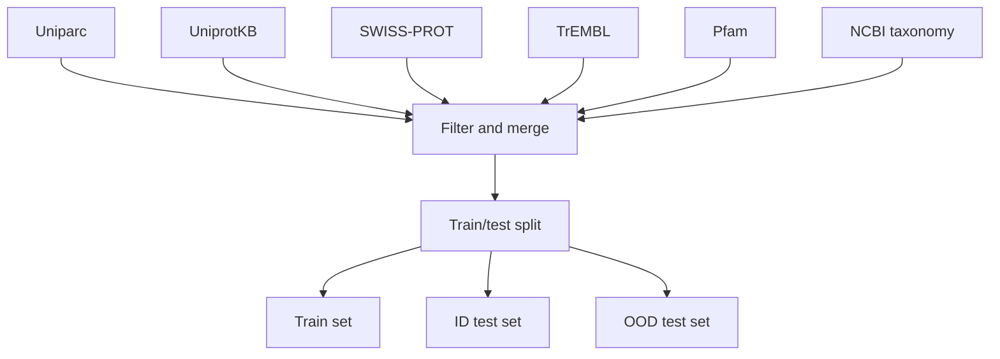

[](https://discord.gg/qUtxnK2NMf)

# Progen
Implementation of Progen in Pytorch, from the paper "ProGen: Language Modeling for Protein Generation"

GPT for proteins sequences

[Paper Link](https://arxiv.org/pdf/2004.03497.pdf)

# Appreciation
* Lucidrains
* Agorians

# Install
`pip install progen-torch`

# Usage
```python
import torch
from progen.model import ProGen

x = torch.randint(0, 100, (1, 1024))
model = ProGen(num_tokens=100, dim=512, seq_len=1024, depth=6)
outputs = model(x)
print(outputs)


```

# Dataset Strategy
Here is a table of the datasets used in the paper with metadata and source links:

| Dataset | Description | Source |
|-|-|-| 
| Uniparc | Contains protein sequences from various sources | https://www.uniprot.org/uniparc/ |
| UniprotKB | Contains protein sequences and annotations | https://www.uniprot.org/uniprot/ |
| SWISS-PROT | Curated protein sequence database | https://www.uniprot.org/swiss-prot/ |
| TrEMBL | Computer-annotated protein sequences | https://www.uniprot.org/trembl/ |
| Pfam | Database of protein families | https://pfam.xfam.org/ |
| NCBI taxonomy | Taxonomic classification of organisms | https://www.ncbi.nlm.nih.gov/taxonomy |

Here is a diagram showing the data preprocessing flow:



The Uniparc, UniprotKB, SWISS-PROT, TrEMBL, Pfam, and NCBI taxonomy datasets are filtered and merged in step B. The aggregated dataset is then split into training, in-distribution test, and out-of-distribution test sets in step H.

# Architecture

# Todo


# License
MIT

# Citations

