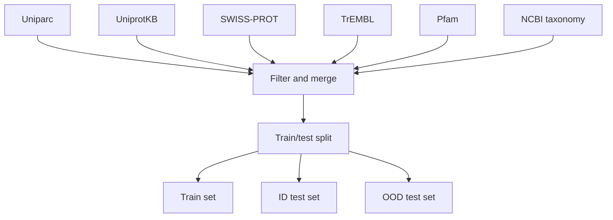

[](https://discord.gg/qUtxnK2NMf)

# Progen
Implementation of Progen in Pytorch, from the paper "ProGen: Language Modeling for Protein Generation"

GPT for proteins sequences

[Paper Link](https://arxiv.org/pdf/2004.03497.pdf)

# Appreciation
* Lucidrains
* Agorians

# Install
`pip install progen-torch`

# Usage
```python
import torch
from progen.model import ProGen

x = torch.randint(0, 100, (1, 1024))
import torch
from progen.model import ProGen

x = torch.randint(0, 100, (1, 1024))

# Initialize the model with specific parameters
model = ProGen(
    num_tokens=100,  # The size of the vocabulary
    dim=512,  # The dimension of the embeddings
    seq_len=1024,  # The length of the sequences
    depth=6,  # The number of layers in the model
    window_size=256,  # The size of the window for local attention
    global_mlp_depth=2,  # The depth of the MLP in the global attention mechanism
    heads=8,  # The number of attention heads
    dim_head=512,  # The dimension of each attention head
    ff_mult=4,  # The multiplier for the feed-forward network's hidden layer size
    ff_glu=True,  # Whether to use a GLU activation in the feed-forward network
    attn_dim=None,  # The dimension of the attention mechanism (None means it defaults to `dim`)
    clamp_gate=True,  # Whether to clamp the gate values in the GLU activation
    shift_tokens=True,  # Whether to shift the tokens for the causal attention mechanism
    dropout=0.1,  # The dropout rate
)

# Forward pass through the model
logits = model(x)

# The output is the logits for each token in the vocabulary, for each position in the input sequences
# Shape: (batch_size, sequence_length, num_tokens)
print(logits.shape)  # Should print: torch.Size([1, 1024, 100])


```

# Dataset Strategy
Here is a table of the datasets used in the paper with metadata and source links:

| Dataset | Description | Source |
|-|-|-| 
| Uniparc | Contains protein sequences from various sources | https://www.uniprot.org/uniparc/ |
| UniprotKB | Contains protein sequences and annotations | https://www.uniprot.org/uniprot/ |
| SWISS-PROT | Curated protein sequence database | https://www.uniprot.org/swiss-prot/ |
| TrEMBL | Computer-annotated protein sequences | https://www.uniprot.org/trembl/ |
| Pfam | Database of protein families | https://pfam.xfam.org/ |
| NCBI taxonomy | Taxonomic classification of organisms | https://www.ncbi.nlm.nih.gov/taxonomy |

Here is a diagram showing the data preprocessing flow:



The Uniparc, UniprotKB, SWISS-PROT, TrEMBL, Pfam, and NCBI taxonomy datasets are filtered and merged in step B. The aggregated dataset is then split into training, in-distribution test, and out-of-distribution test sets in step H.

# Architecture

# Todo


# License
MIT

# Citations

